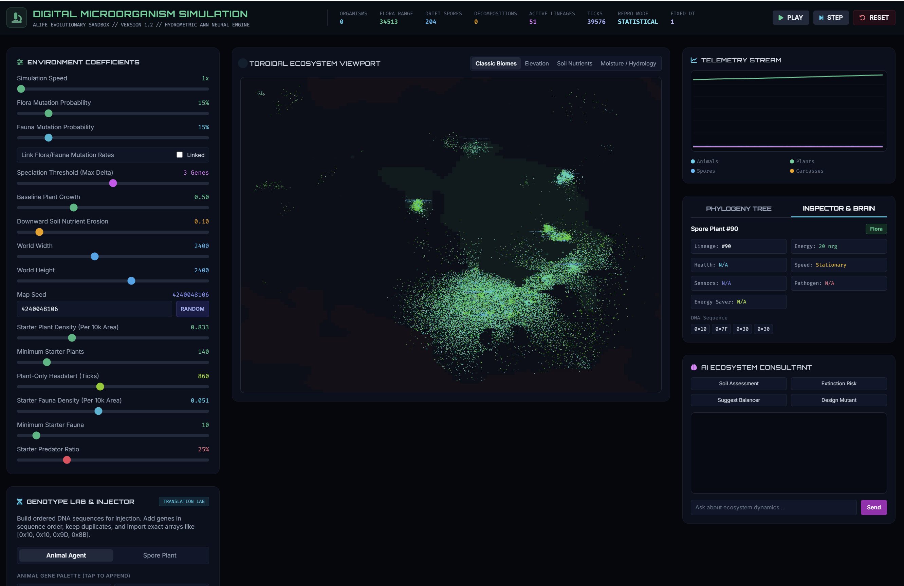
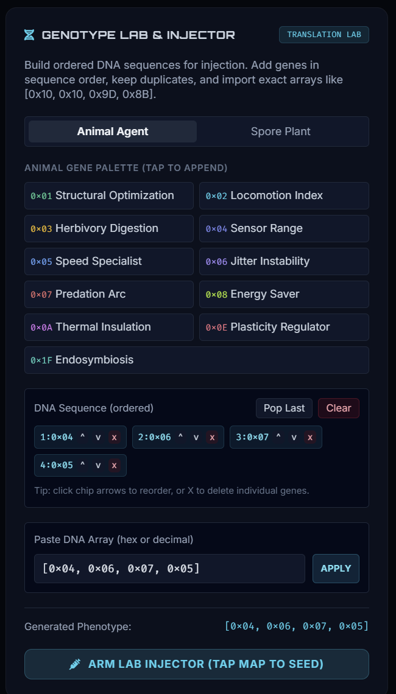
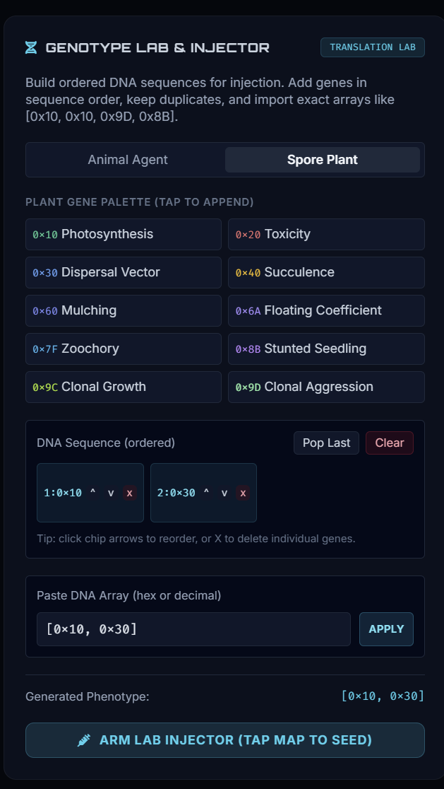

# Digital Organism Simulator

An interactive simulation engine for evolving digital microorganisms, modeling genotype, phenotype, spatial dynamics, and biome interactions.

## Documentation

- [Docs home](docs/README.md)
- [Simulation blueprint and specification](docs/specification/README.md)
- [Implementation and compliance notes](docs/implementation/README.md)
- [Generated reports](docs/reports/README.md)

## Runtime

- Main UI: [digital_microorganism_evolution_engine.html](digital_microorganism_evolution_engine.html)
- Local serve script: [serve.sh](serve.sh)

## Screenshots

### Simulator Main View

### Genotype Lab (Animal)

### Genotype Lab (Plant)

## Quick Start

1. Open [digital_microorganism_evolution_engine.html](digital_microorganism_evolution_engine.html) in a browser, or run [serve.sh](serve.sh).
2. Review the blueprint in [docs/specification/README.md](docs/specification/README.md).
3. Use the conformance and replay reports under [docs/reports/README.md](docs/reports/README.md) when validating changes.